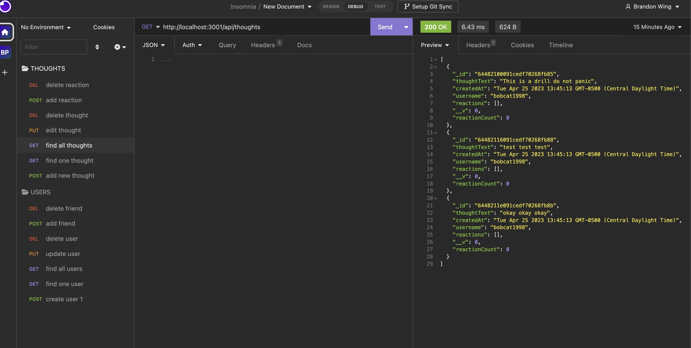

# Module 18: NoSQL Social Media API

## Description
  This project is the back end of an API for a social network app where users can share their thoughts, react to thoughts, and create a friends list. It utilizes ExpressJS and Mongoose/MongoDB.

# Table of Contents

- [Installation](#installation)
- [Usage](#usage)
- [License](#license)
- [Credits](#credits)
- [Walkthrough](#walkthrough)
- [Contributions](#contributions)
- [Other Resources Used](#other)

## Installation
  1. Clone the reposition. 
  2. install necessary dependencies. 
  3. run npm start from source folder.

## Credits
https://github.com/rudyxwhite

## Walkthrough

Here is a link to the walkthrough video

https://youtu.be/fnR3ZxPeaw0

## Contact Information
  brandonrwing98@gmail.com
       
## Contributions
  no contributions allowed at this time.

## Other Resources Used

Help I found along the way!!!

https://stackoverflow.com/questions/17899750/how-can-i-generate-an-objectid-with-mongoose

https://mongoosejs.com/docs/2.7.x/docs/schematypes.html

https://mongoosejs.com/docs/api/mongoose.html

https://mongoosejs.com/docs/tutorials/dates.html
